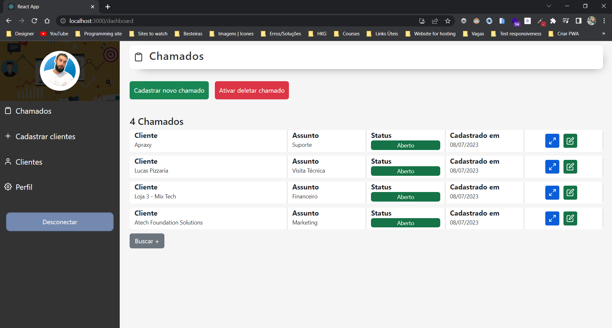
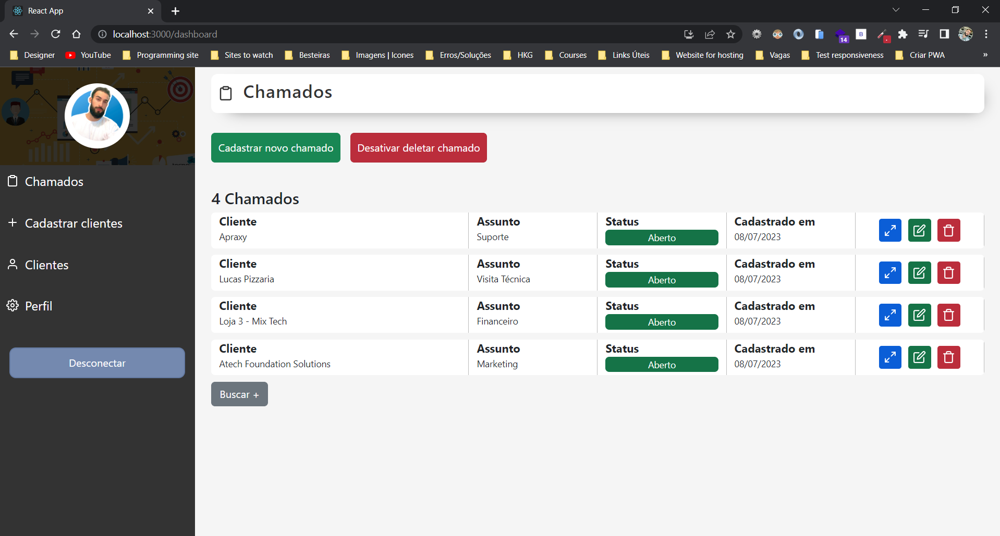
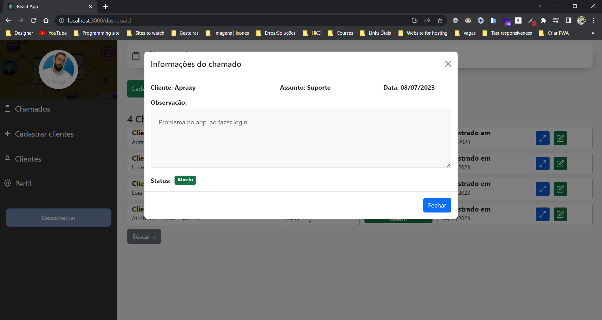
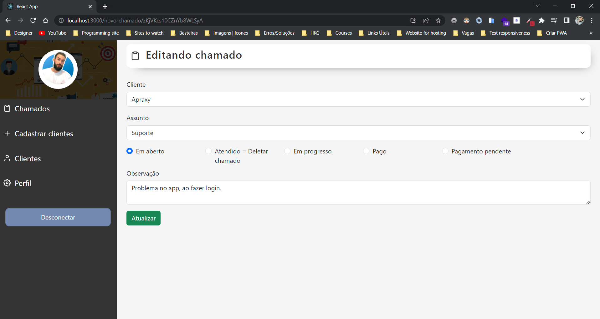
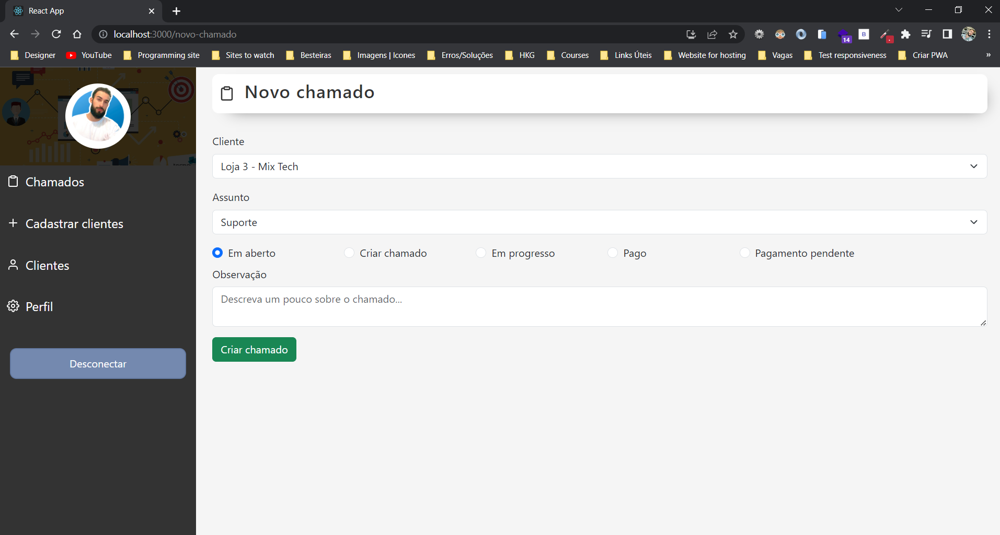
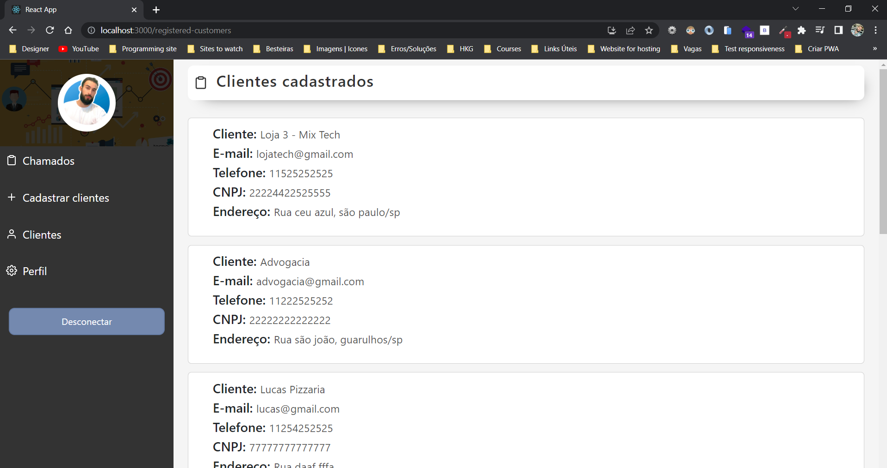
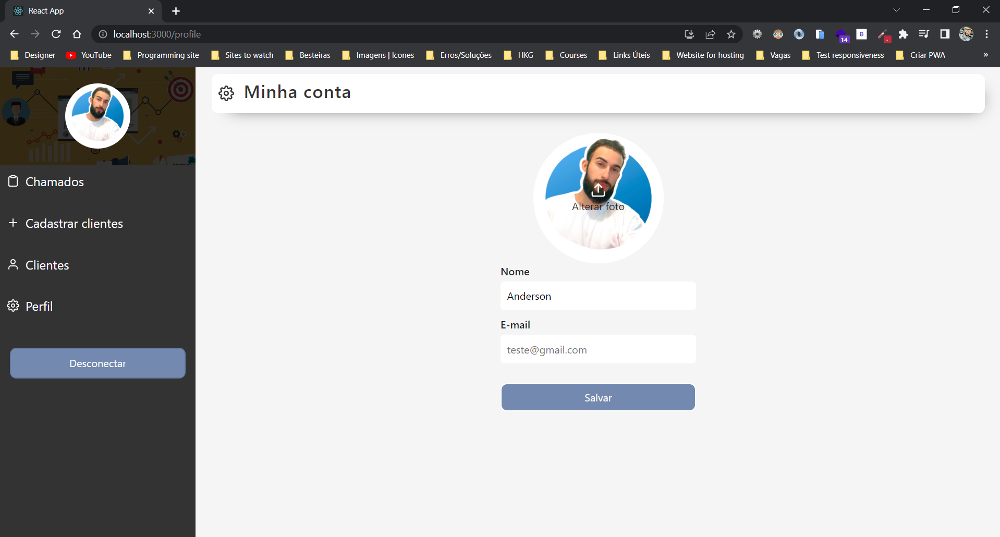

## Sistema de Chamados com React.js

## Deploy: https://sistema-de-chamado.vercel.app/

 

## Descrição do projeto
   Com esse sistema de chamados você pode cadastrar um cliente, criar um chamado   selecionando o 
   cliente desejado, pode editar o chamado, excluir um chamado e visualizar   todos os clientes 
   cadastrados no sistema.

  

## Este projeto foi utilizado
- Firebase
- Firestore como banco de dados
- Authentication para efetuar cadastro e login
- Cloud Storage para armazenar as imagens

  

## Screenshot do sistema

 
 
 
 
 
 
 

